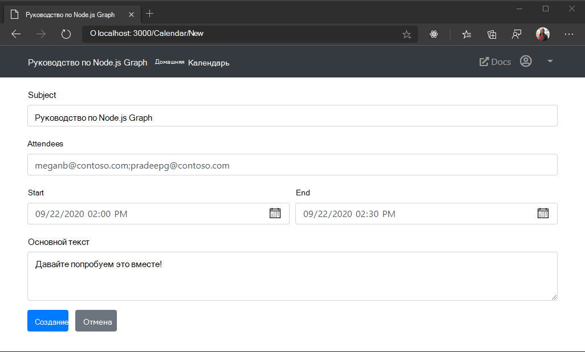

<!-- markdownlint-disable MD002 MD041 -->

В этом разделе мы добавим возможность создания событий в календаре пользователя.

## Создание новой формы события

1. Создайте новый файл в каталоге **./views** с именем **невевент. ХБС** и добавьте следующий код.

    :::code language="html" source="../demo/graph-tutorial/views/newevent.hbs" id="NewEventFormSnippet":::

1. Добавьте следующий код в файл **./раутес/calendar.js** перед `module.exports = router;` строкой.

    :::code language="javascript" source="../demo/graph-tutorial/routes/calendar.js" id="GetEventFormSnippet":::

Это реализует форму для ввода данных пользователем и отображает ее.

## Создание события

1. Откройте **graph.js** и добавьте указанную ниже функцию `module.exports` .

    :::code language="javascript" source="../demo/graph-tutorial/graph.js" id="CreateEventSnippet":::

    Этот код использует поля формы для создания объекта события Graph, а затем отправляет запрос POST в `/me/events` конечную точку, чтобы создать событие в календаре пользователя по умолчанию.

1. Добавьте следующий код в файл **./раутес/calendar.js** перед `module.exports = router;` строкой.

    :::code language="javascript" source="../demo/graph-tutorial/routes/calendar.js" id="PostEventFormSnippet":::

    Этот код проверяет и проверит входные данные формы, а затем вызывает ее `graph.createEvent` для создания события. После завершения вызова он перенаправляется обратно в представление календаря.

1. Сохраните изменения и перезапустите приложение. Щелкните элемент навигации по **календарю** , а затем нажмите кнопку **создать событие** . Введите значения и нажмите кнопку **создать**. Приложение возвращается в представление календаря после создания нового события.

    
