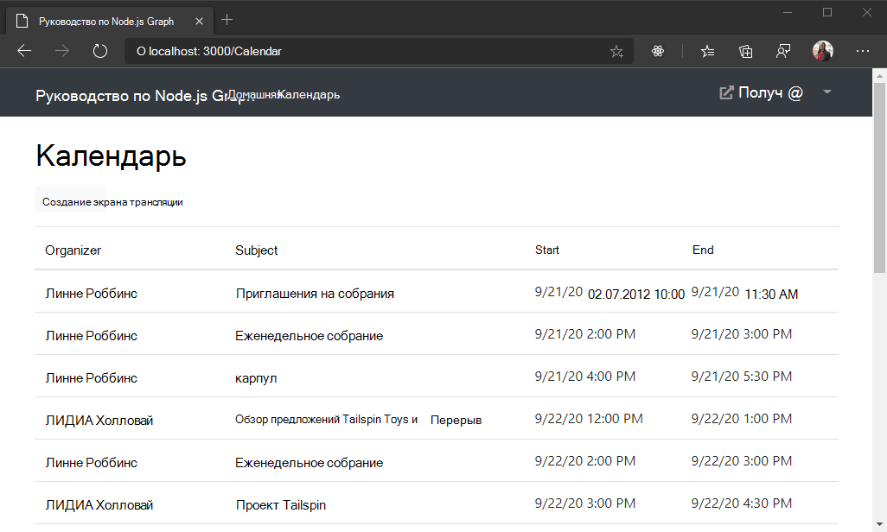

<!-- markdownlint-disable MD002 MD041 -->

В этом упражнении вы добавите Microsoft Graph в приложение. В этом приложении для совершения вызовов в Microsoft Graph будет использоваться клиентская библиотека [Microsoft](https://github.com/microsoftgraph/msgraph-sdk-javascript) Graph.

## <a name="get-calendar-events-from-outlook"></a>Получение событий календаря из Outlook

Для начала добавьте в `./graph.js` файл новый метод, чтобы получить события из календаря. Добавьте следующую функцию в файле `module.exports` in. `./graph.js`

```js
getEvents: async function(accessToken) {
  const client = getAuthenticatedClient(accessToken);

  const events = await client
    .api('/me/events')
    .select('subject,organizer,start,end')
    .orderby('createdDateTime DESC')
    .get();

  return events;
}
```

РасСмотрите, что делает этот код.

- URL-адрес, который будет вызываться — это `/me/events`.
- `select` Метод ограничит поля, возвращаемые для каждого события, только теми, которые будут реально использоваться в представлении.
- `orderby` Метод сортирует результаты по дате и времени создания, начиная с самого последнего элемента.

Создайте новый файл в `./routes` каталоге с именем `calendar.js`и добавьте приведенный ниже код.

```js
var express = require('express');
var router = express.Router();
var tokens = require('../tokens.js');
var graph = require('../graph.js');

/* GET /calendar */
router.get('/',
  async function(req, res) {
    if (!req.isAuthenticated()) {
      // Redirect unauthenticated requests to home page
      res.redirect('/')
    } else {
      let params = {
        active: { calendar: true }
      };

      // Get the access token
      var accessToken;
      try {
        accessToken = await tokens.getAccessToken(req);
      } catch (err) {
        res.json(err);
      }

      if (accessToken && accessToken.length > 0) {
        try {
          // Get the events
          var events = await graph.getEvents(accessToken);

          res.json(events.value);
        } catch (err) {
          res.json(err);
        }
      }
    }
  }
);

module.exports = router;
```

Обновите `./app.js` , чтобы использовать этот новый маршрут. Добавьте указанную ниже **** строку перед `var app = express();` строкой.

```js
var calendarRouter = require('./routes/calendar');
```

Затем добавьте следующую строку **после** `app.use('/auth', authRouter);` строки.

```js
app.use('/calendar', calendarRouter);
```

Теперь вы можете протестировать это. Войдите и щелкните ссылку **Календарь** на панели навигации. Если все работает, вы должны увидеть дамп событий JSON в календаре пользователя.

## <a name="display-the-results"></a>Отображение результатов

Теперь вы можете добавить представление для отображения результатов более удобным для пользователя способом. Сначала добавьте следующий код `./app.js` **после** `app.set('view engine', 'hbs');` строки.

```js
var hbs = require('hbs');
var moment = require('moment');
// Helper to format date/time sent by Graph
hbs.registerHelper('eventDateTime', function(dateTime){
  return moment(dateTime).format('M/D/YY h:mm A');
});
```

В этом случае реализуется [вспомогательный модуль handlebars](http://handlebarsjs.com/#helpers) для форматирования даты ISO 8601, возвращаемой Microsoft Graph, в нечто более удобное для человека.

Создайте новый файл в `./views` каталоге `calendar.hbs` и добавьте указанный ниже код.

```html
<h1>Calendar</h1>
<table class="table">
  <thead>
    <tr>
      <th scope="col">Organizer</th>
      <th scope="col">Subject</th>
      <th scope="col">Start</th>
      <th scope="col">End</th>
    </tr>
  </thead>
  <tbody>
    {{#each events}}
      <tr>
        <td>{{this.organizer.emailAddress.name}}</td>
        <td>{{this.subject}}</td>
        <td>{{eventDateTime this.start.dateTime}}</td>
        <td>{{eventDateTime this.end.dateTime}}</td>
      </tr>
    {{/each}}
  </tbody>
</table>
```

Это приведет к перебору коллекции событий и добавлению строки таблицы для каждой из них. Теперь обновите маршрут в `./routes/calendar.js` поле, чтобы использовать это представление. Замените существующий маршрут следующим кодом.

```js
router.get('/',
  async function(req, res) {
    if (!req.isAuthenticated()) {
      // Redirect unauthenticated requests to home page
      res.redirect('/')
    } else {
      let params = {
        active: { calendar: true }
      };

      // Get the access token
      var accessToken;
      try {
        accessToken = await tokens.getAccessToken(req);
      } catch (err) {
        req.flash('error_msg', {
          message: 'Could not get access token. Try signing out and signing in again.',
          debug: JSON.stringify(err)
        });
      }

      if (accessToken && accessToken.length > 0) {
        try {
          // Get the events
          var events = await graph.getEvents(accessToken);
          params.events = events.value;
        } catch (err) {
          req.flash('error_msg', {
            message: 'Could not fetch events',
            debug: JSON.stringify(err)
          });
        }
      }

      res.render('calendar', params);
    }
  }
);
```

Сохраните изменения, перезапустите сервер и войдите в приложение. Щелкните ссылку **Календарь** , после чего приложение должно отобразить таблицу событий.

